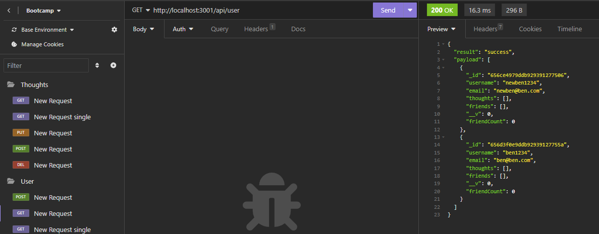

# Module 18 Challenge - Social Network API

## Description of Work
Created an Social Network application to track users, thoughts, and reactions using JS and npm: express and mongoose.

## Final Screenshot

## Links
[GitHub](https://github.com/bpavlis/social-network)

[Working Video](https://drive.google.com/file/d/1IZqdvw5QWTlofrikjj03MdtV1owQlgq9/view)

## Additional Note
This work was completed partially using the aid of a template given to us by our instructor as well as code from the student-project in this unit, he had given us permission to do this.